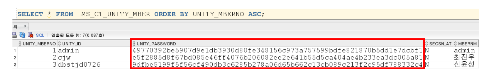
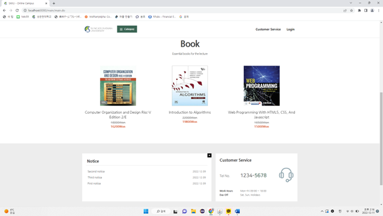

## 대회명
2022학년도 성균관대학교 Web App Innovation Contest

 

## 프로젝트 개요 
### Subject
성균관대학교 온라인 전공서점 사이트
### About
교내 전공강의에 필요한 교재들을 구매할 수 있는 Spring Framework 기반 홈페이지
### Duration
2022.09 ~ 2022.12
### Team
|팀장|팀원|
|:---:|:---:|
|최진우|신윤성|
|백엔드 개발 및 서버 환경 구축 |프론트엔드 개발|

### ERD

### Functionality

#### 비밀번호 암호화

- 개인정보보호를 위해 비밀번호에 AES256 암호화를 적용했습니다.

 

#### 비밀번호 분실 코드 전송 

- 비밀번호 분실 시 회원가입 때 입력한 이메일로 임의로 생성된 코드를 전송합니다.
- 위 코드를 통해 신규 비밀번호를 설정할 수 있습니다.

#### 반응형 웹

- 보다 편한 사용을 위해 반응형 웹을 지원합니다.

#### DAUM 주소 찾기

- DAUM 지도 API와 연동하여 주소 찾기가 가능합니다.

 

## Page
### 메인 페이지

- 메인 배너를 통해 현재 서비스되고 있는 전공 강의를 확인할 수 있습니다.
- 하단 GNB를 통해 강의 소개, 서점, 게시판, 고객 센터로 이동할 수 있습니다.

- 현재 판매되고 있는 책을 한눈에 확인할 수 있습니다.

### 회원가입 페이지

- 개인정보를 통해 회원가입이 가능합니다.
- 추후 회원정보 수정이 가능합니다.

### 구매 페이지

- 구매하고자 하는 서점을 카드/계좌이체로 결제할 수 있습니다.
- 배송 정보의 경우, 가입 시 입력한 정보를 불러와 쉽게 주문이 가능합니다.

### 강의 및 교재 페이지

- 강의에 대한 기본적인 소개가 나와있습니다.

- 강의별 사용하는 전공 서적이 DB에 맵핑되어 자신이 수강하는 강의에서 어떤 교재를 사용하는지 쉽게 알 수 있습니다.

- 교재를 클릭하면 교재의 상세 정보 및 수량과 가격을 정할 수 있습니다.

### 질문 게시판 페이지

- 사용자는 문의 사항을 게시판에 올릴 수 있습니다.
- 위와 같이 관리자 계정으로 로그인하면 답변을 남길 권한이 생깁니다.

 

## 기술 스택
### Environment

### Framework

### WAS

### Development

